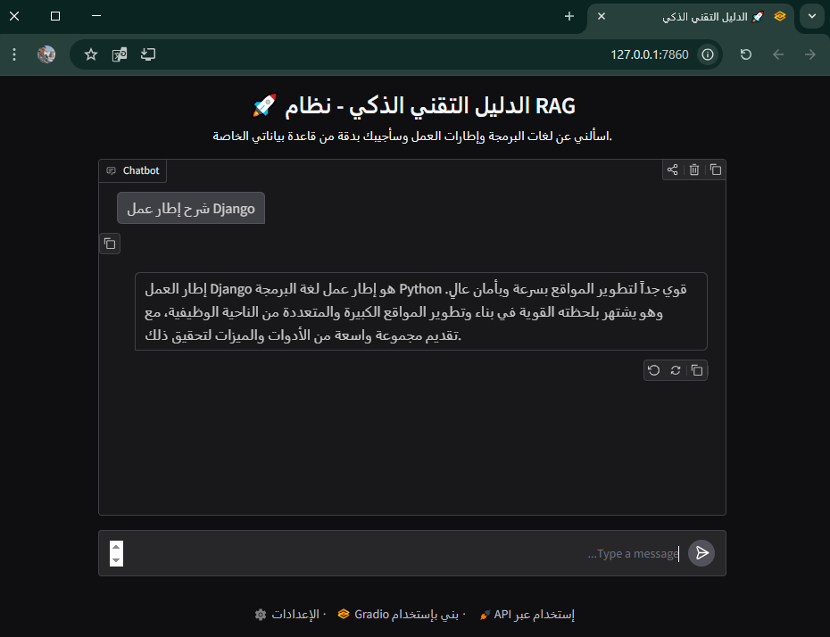
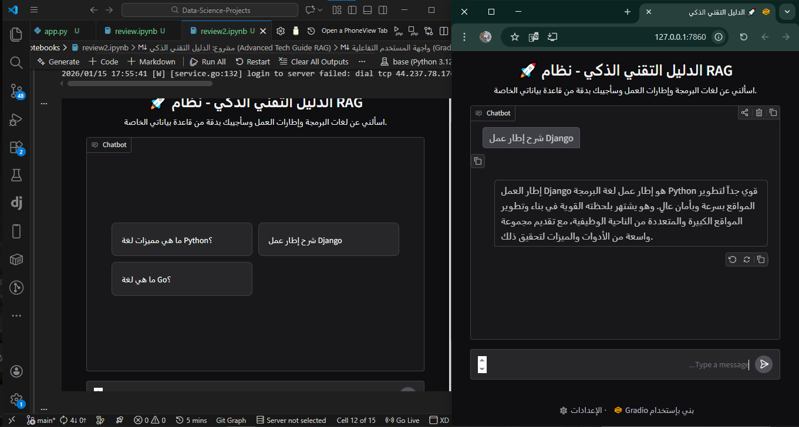

# 🚀 Advanced Tech Guide RAG System

**Developer:** Loay Alrazi (IT Graduate - Dhamar University)

## 🎯 Overview
An end-to-end Local RAG (Retrieval-Augmented Generation) system designed to provide accurate information about 20+ programming languages and 10+ frameworks. 

## 🛠 Technical Architecture
- **Data Source:** Structured CSV file (`data/tech_data.csv`).
- **Vector Database:** ChromaDB for efficient semantic search.
- **LLM:** Llama 3 (via Ollama) for generating human-like Arabic responses.
- **Embedding Model:** `all-MiniLM-L6-v2` (Sentence-Transformers).
- **UI:** Interactive Gradio interface with RTL (Right-to-Left) support.

## ⚙️ How it Works
1. **Ingestion:** Reads technical data from CSV.
2. **Vectorization:** Converts text into 384-dimensional vectors using Sentence-Transformers.
3. **Retrieval:** Finds the most relevant technical context based on user query via ChromaDB.
4. **Generation:** Llama 3 crafts a concise Arabic answer based strictly on the retrieved context.

### 🖥 Development Environment
Below is a full view of the development environment in VS Code while running the system:

## 📌 Requirements
- Python 3.10+
- Ollama (running Llama 3)
- Libraries: `chromadb`, `sentence-transformers`, `gradio`, `pandas`.